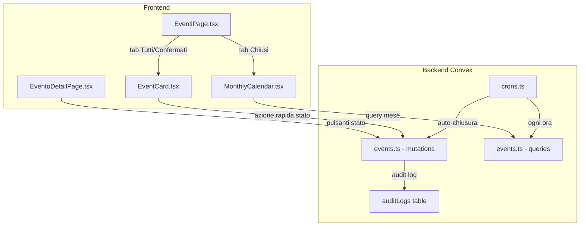
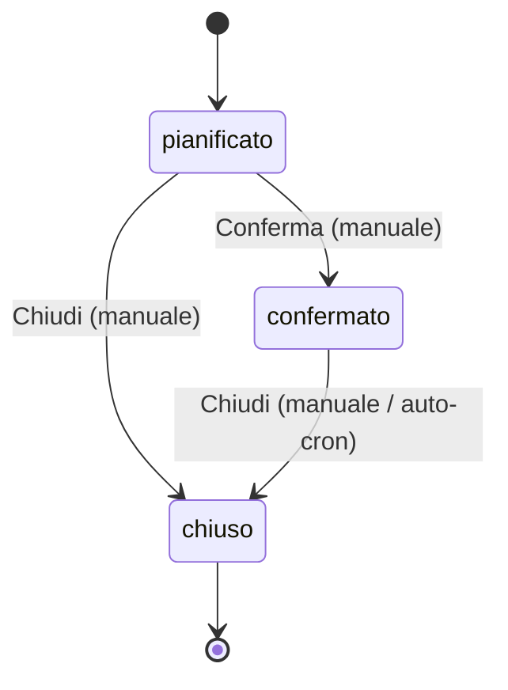

# Design Tecnico — Event Status Calendar

## Overview

Questa feature estende il modulo eventi di Maestrale con tre capacità principali:

1. **Transizioni di stato manuali** — Mutazione backend dedicata `updateEventStatus` che valida le transizioni consentite (pianificato→confermato, confermato→chiuso, pianificato→chiuso) e impedisce quelle invalide. I pulsanti di transizione appaiono sia nella pagina di dettaglio che nelle card della lista eventi, visibili solo ad admin/direttivo.

2. **Auto-chiusura cron** — Un cron job Convex (`convex/crons.ts`) che ogni ora interroga gli eventi confermati con `dataFine` passata e li chiude automaticamente, registrando l'azione nell'audit log con indicazione "auto-chiusura".

3. **Tab "Chiusi" con calendario mensile** — Un nuovo tab nella pagina eventi che, quando selezionato, sostituisce la griglia di card con un componente `MonthlyCalendar`. Il calendario mostra una griglia 7 colonne (lun-dom) con gli eventi chiusi posizionati nel giorno della loro `dataInizio`. Una query backend dedicata `listClosedEventsByMonth` alimenta il calendario in modo efficiente.

### Decisioni architetturali chiave

- **Mutazione dedicata per transizioni di stato** anziché riutilizzare `updateEvent`: separa la logica di validazione delle transizioni dalla modifica dei campi, evitando che un update generico possa bypassare le regole di stato.
- **Cron Convex nativo** (`cronJobs`): il progetto non ha ancora cron jobs, quindi si crea `convex/crons.ts` con `cronJobs.interval()`.
- **Query dedicata per mese** con indice `by_stato` + filtro in-memory su `dataInizio`: evita scan completi della tabella e restituisce solo i campi necessari al calendario.
- **Componente calendario custom** con Tailwind: leggero, senza dipendenze esterne, coerente con il design system esistente.

## Architecture



### Flusso transizione di stato



## Components and Interfaces

### Backend — Nuova mutation `updateEventStatus`

```typescript
// convex/events.ts
export const updateEventStatus = mutation({
  args: {
    eventId: v.id("events"),
    newStatus: v.union(
      v.literal("confermato"),
      v.literal("chiuso")
    ),
  },
  handler: async (ctx, args) => {
    // 1. requireAdminOrDirettivo(ctx)
    // 2. Fetch event, validate exists
    // 3. Validate transition: ALLOWED_TRANSITIONS[currentStatus].includes(newStatus)
    // 4. Patch event stato + updatedAt
    // 5. Audit log con summary "Stato cambiato da X a Y"
  },
});
```

Mappa transizioni consentite:
```typescript
const ALLOWED_TRANSITIONS: Record<string, string[]> = {
  pianificato: ["confermato", "chiuso"],
  confermato: ["chiuso"],
  chiuso: [], // nessuna transizione in uscita
};
```

### Backend — Nuova query `listClosedEventsByMonth`

```typescript
// convex/events.ts
export const listClosedEventsByMonth = query({
  args: {
    year: v.number(),
    month: v.number(), // 1-12
  },
  handler: async (ctx, args) => {
    // 1. Calcola range ISO: startOfMonth, endOfMonth
    // 2. Query con indice by_stato per stato="chiuso"
    // 3. Filtra in-memory: dataInizio >= startOfMonth && dataInizio < startOfNextMonth
    // 4. Ordina per dataInizio crescente
    // 5. Per ogni evento, conta partecipanti
    // 6. Restituisce: { _id, nome, dataInizio, dataFine, localita, durataMinuti, participantCount }
  },
});
```

### Backend — Internal mutation `autoCloseExpiredEvents`

```typescript
// convex/events.ts
export const autoCloseExpiredEvents = internalMutation({
  args: {},
  handler: async (ctx) => {
    // 1. Query eventi con stato="confermato"
    // 2. Filtra: dataFine < now (ISO string comparison)
    // 3. Per ogni evento scaduto:
    //    a. Patch stato="chiuso", updatedAt=now
    //    b. Audit log con summary "Auto-chiusura: evento scaduto"
    //    c. Try/catch per continuare in caso di errore su singolo evento
  },
});
```

### Backend — Cron job

```typescript
// convex/crons.ts
import { cronJobs } from "convex/server";
import { internal } from "./_generated/api";

const crons = cronJobs();

crons.interval(
  "auto-close-expired-events",
  { hours: 1 },
  internal.events.autoCloseExpiredEvents
);

export default crons;
```

### Frontend — Componente `MonthlyCalendar`

```typescript
// src/components/events/MonthlyCalendar.tsx
interface MonthlyCalendarProps {
  year: number;
  month: number; // 1-12
  onMonthChange: (year: number, month: number) => void;
}
```

Responsabilità:
- Griglia 7 colonne (Lun-Dom) con righe per coprire il mese
- Navigazione mese precedente/successivo
- Mostra nome evento nel giorno di `dataInizio`
- Max 2 eventi visibili per giorno su desktop, "+N altri" se > 2
- Su mobile: solo indicatore numerico del conteggio eventi per giorno
- Evidenzia giorno corrente
- Click su evento → navigazione a `/eventi/{id}`

### Frontend — Modifiche a `EventiPage.tsx`

- Aggiungere stato `pianificato` ai tab: `['tutti', 'pianificato', 'confermato', 'chiuso']`
  - Nota: i requisiti specificano tre tab "Tutti", "Confermati", "Chiusi". I tab attuali sono già "tutti", "confermato", "chiuso". Si mantiene la struttura esistente.
- Quando `statoFilter === 'chiuso'`: renderizzare `MonthlyCalendar` al posto della griglia di card
- Gestire stato locale `calendarYear` e `calendarMonth` per la navigazione del calendario

### Frontend — Modifiche a `EventoDetailPage.tsx`

- Aggiungere pulsante "Conferma" visibile quando `stato === 'pianificato'` e `canEdit`
- Pulsante "Chiudi" già presente, ma va mostrato anche per stato "confermato"
- Quando `stato === 'chiuso'`: nascondere tutti i pulsanti di azione (già parzialmente implementato)
- Aggiungere dialogo di conferma per il pulsante "Conferma" (opzionale, il requisito lo richiede solo per "Chiudi")

### Frontend — Modifiche a `EventCard.tsx`

- Aggiungere dropdown/pulsanti di azione rapida per cambio stato
- Visibili solo se `canEdit` e `stato !== 'chiuso'`
- Per "pianificato": mostrare "Conferma" e "Chiudi"
- Per "confermato": mostrare "Chiudi"
- Usare `useMutation(api.events.updateEventStatus)` per eseguire la transizione

## Data Models

### Schema esistente (nessuna modifica)

La tabella `events` ha già tutti i campi necessari:

```typescript
events: defineTable({
  nome: v.string(),
  localita: v.optional(v.string()),
  dataInizio: v.string(),    // ISO datetime
  dataFine: v.string(),      // ISO datetime
  durataMinuti: v.number(),
  stato: v.union(v.literal("pianificato"), v.literal("confermato"), v.literal("chiuso")),
  attrezzaturePreventivo: v.array(v.string()),
  note: v.optional(v.string()),
  createdAt: v.number(),
  updatedAt: v.number(),
})
  .index("by_stato", ["stato"])
  .index("by_data_inizio", ["dataInizio"])
  .index("by_data_fine", ["dataFine"])
```

L'indice `by_stato` è già presente e verrà usato sia dalla query `listClosedEventsByMonth` che dal cron job `autoCloseExpiredEvents`.

### Audit log (nessuna modifica allo schema)

La tabella `auditLogs` supporta già `entityType: "events"` e i campi `action`, `summary`, `changes`. Il cron job userà un `actorUserId` di sistema — poiché il cron è un `internalMutation` senza contesto utente, si creerà una variante di `createAuditLog` che accetta un userId opzionale o si usa un approccio con userId di sistema.

**Decisione**: Per il cron job, si creerà una funzione helper `createSystemAuditLog` che non richiede autenticazione e usa un campo `summary` che indica chiaramente "Auto-chiusura automatica".


## Correctness Properties

*A property is a characteristic or behavior that should hold true across all valid executions of a system — essentially, a formal statement about what the system should do. Properties serve as the bridge between human-readable specifications and machine-verifiable correctness guarantees.*

### Property 1: State transition validity is exhaustive

*For any* pair (currentState, targetState) drawn from the set {"pianificato", "confermato", "chiuso"} × {"pianificato", "confermato", "chiuso"}, calling `updateEventStatus` should succeed if and only if the pair is in the allowed transitions set {(pianificato, confermato), (pianificato, chiuso), (confermato, chiuso)}. All other pairs should result in an error.

**Validates: Requirements 1.1, 1.2**

### Property 2: State transitions produce audit log entries

*For any* valid state transition on any event, after the transition completes, the audit log should contain a new entry with `entityType: "events"`, `entityId` matching the event, `action: "update"`, and a `summary` that includes both the old and new state.

**Validates: Requirements 1.3**

### Property 3: Closed events are immutable

*For any* event with `stato === "chiuso"` and any set of field updates (nome, localita, dataInizio, dataFine, note, attrezzaturePreventivo), calling `updateEvent` should be rejected with an error, and the event's fields should remain unchanged.

**Validates: Requirements 1.4**

### Property 4: Auto-closure targets exactly expired confirmed events

*For any* set of events where some have `stato === "confermato"` and `dataFine < now`, running `autoCloseExpiredEvents` should set `stato` to `"chiuso"` for exactly those events, leave all other events unchanged, and create an audit log entry for each closed event indicating automatic closure.

**Validates: Requirements 4.2, 4.3**

### Property 5: Calendar grid structure is correct for any month

*For any* valid (year, month) pair, the generated calendar grid should have exactly 7 columns, the first day of the month should fall on the correct weekday column (Monday=0 through Sunday=6), and the grid should contain enough rows to cover all days of the month including padding days from adjacent months.

**Validates: Requirements 6.1**

### Property 6: Events are placed on the correct calendar day

*For any* closed event with a `dataInizio` falling in the displayed month, the event name should appear in the cell corresponding to the day-of-month extracted from `dataInizio`. Events with `dataInizio` outside the displayed month should not appear in any cell.

**Validates: Requirements 6.3**

### Property 7: Overflow indicator shows correct count

*For any* calendar day cell containing N closed events where N > 2, the cell should display exactly 2 event names and an indicator showing "+{N-2} altri".

**Validates: Requirements 6.4**

### Property 8: Monthly closed events query returns correct results

*For any* (year, month) pair and any set of events in the database, `listClosedEventsByMonth` should return exactly those events where `stato === "chiuso"` AND `dataInizio` falls within the specified month, ordered by `dataInizio` ascending, and each result should include the fields: nome, dataInizio, dataFine, localita, durataMinuti, participantCount.

**Validates: Requirements 7.1, 7.2, 7.3**

## Error Handling

### Backend

| Scenario | Comportamento | Messaggio |
|----------|--------------|-----------|
| Transizione di stato non consentita | Throw Error, nessuna modifica | `"Transizione non consentita: da {stato_corrente} a {stato_richiesto}"` |
| Evento non trovato | Throw Error | `"Evento non trovato"` |
| Utente non autorizzato | Throw Error (da `requireAdminOrDirettivo`) | `"Accesso non autorizzato"` |
| Modifica campi evento chiuso | Throw Error, nessuna modifica | `"Non è possibile modificare un evento chiuso"` |
| Errore singolo evento nel cron | Log errore, continua con il prossimo evento | Log interno con dettagli errore |
| Anno/mese non valido nella query | Restituisce array vuoto | Nessun errore, risultato vuoto |

### Frontend

| Scenario | Comportamento |
|----------|--------------|
| Errore nella transizione di stato | Toast di errore con messaggio dal backend |
| Errore nel caricamento calendario | Mostra stato vuoto con messaggio "Errore nel caricamento" |
| Navigazione a mese senza eventi | Mostra calendario vuoto con celle senza eventi |
| Utente senza permessi | Pulsanti di transizione non renderizzati (controllo `canEdit`) |

## Testing Strategy

### Property-Based Testing

Libreria: **fast-check** (già compatibile con l'ecosistema TypeScript/Vitest del progetto)

Configurazione: minimo 100 iterazioni per ogni property test.

Ogni test deve essere taggato con un commento che referenzia la property del design:

```typescript
// Feature: event-status-calendar, Property 1: State transition validity is exhaustive
```

Property test da implementare:

1. **State transition validity** (Property 1): Generare coppie random (currentState, targetState) e verificare che il risultato (successo/errore) corrisponda alla mappa delle transizioni consentite.

2. **Audit log on transitions** (Property 2): Per ogni transizione valida generata, verificare che esista un audit log entry corrispondente.

3. **Closed event immutability** (Property 3): Generare aggiornamenti random su eventi chiusi e verificare che vengano tutti rifiutati.

4. **Auto-closure correctness** (Property 4): Generare set random di eventi con stati e date variabili, eseguire auto-closure, verificare che solo quelli confermati con dataFine passata vengano chiusi.

5. **Calendar grid structure** (Property 5): Generare coppie random (year, month) e verificare la struttura della griglia (7 colonne, righe corrette, primo giorno posizionato correttamente).

6. **Event placement in calendar** (Property 6): Generare eventi random con date nel mese e verificare che appaiano nella cella del giorno corretto.

7. **Overflow indicator** (Property 7): Generare giorni con numero random di eventi (0-10) e verificare che l'indicatore "+N altri" appaia correttamente quando > 2.

8. **Monthly query correctness** (Property 8): Generare set random di eventi con stati e date variabili, eseguire la query per un mese specifico, verificare che i risultati siano corretti, ordinati e con i campi richiesti.

### Unit Testing

I test unitari coprono casi specifici e edge case non coperti dai property test:

- Transizione pianificato → confermato (esempio specifico)
- Transizione chiuso → pianificato rifiutata (esempio specifico)
- Cron job con zero eventi da chiudere
- Calendario per febbraio in anno bisestile
- Calendario per mese con primo giorno di lunedì vs domenica
- Query per mese senza eventi chiusi (risultato vuoto)
- Rendering pulsanti per ogni combinazione stato/ruolo utente
- Click su evento nel calendario naviga alla pagina corretta
